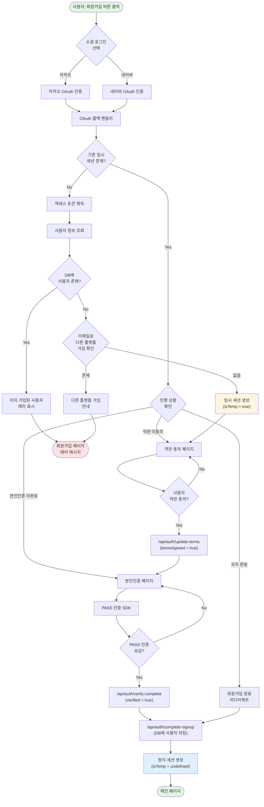
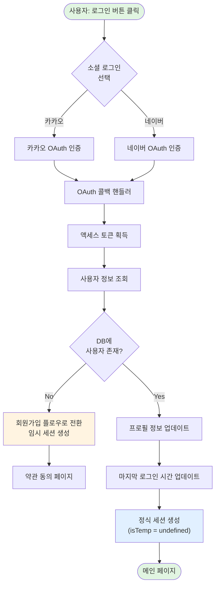
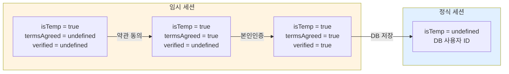
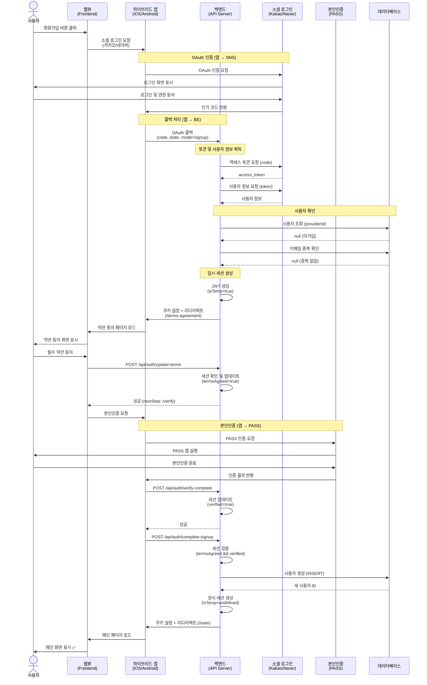
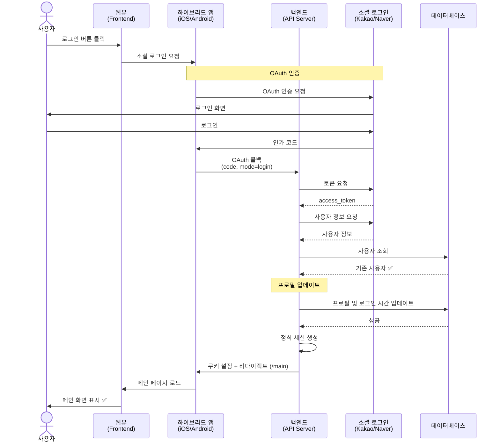
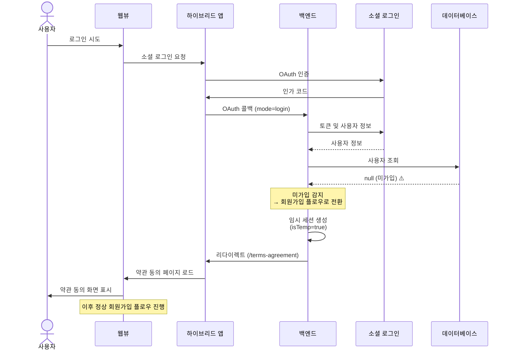
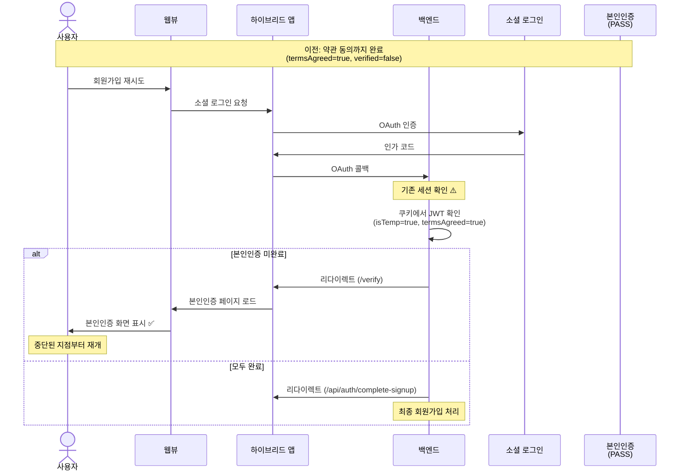
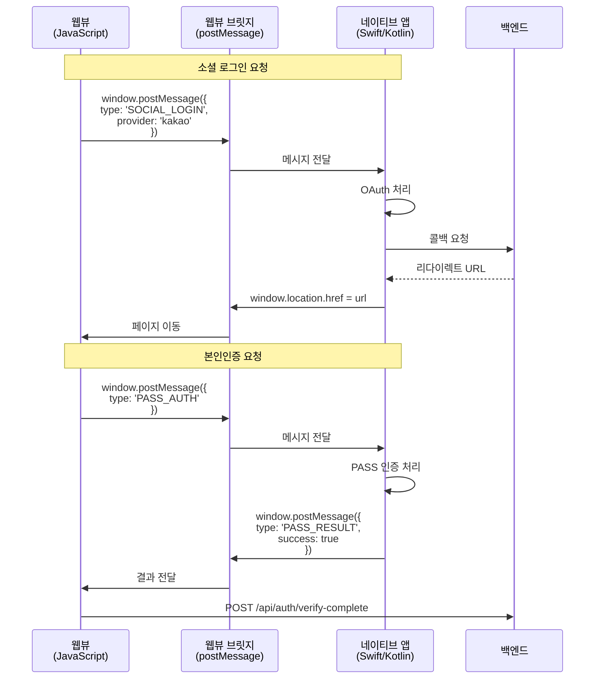
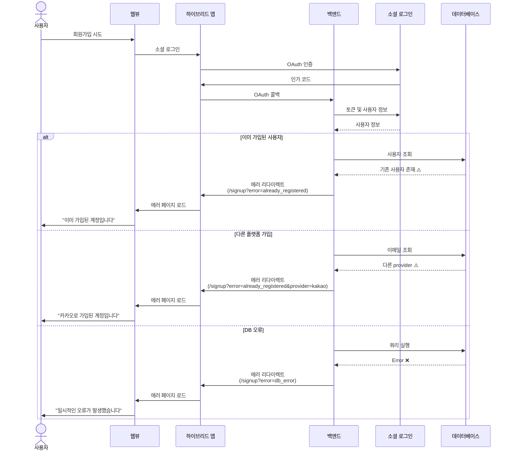

# 인증 시스템 로직 문서

## 개요

POC 프로젝트의 인증 시스템은 **카카오(Kakao)**와 **네이버(Naver)** OAuth 2.0을 통한 소셜 로그인을 지원합니다.

### 주요 특징

- **모드 기반 인증**: 회원가입(`signup`)과 로그인(`login`) 모드를 구분하여 처리
- **다단계 회원가입**: OAuth → 약관 동의 → 본인인증 → DB 저장의 4단계 프로세스
- **임시 세션 관리**: 회원가입 진행 중 JWT를 통해 임시 세션 유지
- **중단 복구**: 회원가입 중단 시 기존 진행 상황에서 재개 가능

---

## 전체 플로우차트

### 1. 회원가입 플로우



### 2. 로그인 플로우



### 3. 세션 상태 관리



---

## 시퀀스 다이어그램 (하이브리드 앱)

> **하이브리드 앱 환경**: 웹뷰(FE)가 네이티브 앱 내부에서 실행되며, OAuth 및 본인인증은 앱을 통해 처리됩니다.

### 1. 회원가입 플로우 (신규 사용자)



### 2. 로그인 플로우 (기존 사용자)



### 3. 로그인 플로우 (미가입 → 회원가입 전환)



### 4. 회원가입 중단 후 재개



### 5. 앱-웹뷰 통신 플로우



### 6. 에러 처리



---

## 하이브리드 앱 통신 구조

### 웹뷰 ↔ 앱 통신 방식

```typescript
// Frontend (웹뷰)
interface WebViewMessage {
  type: "SOCIAL_LOGIN" | "PASS_AUTH" | "GET_DEVICE_INFO";
  provider?: "kakao" | "naver";
  data?: any;
}

// 앱으로 메시지 전송
function sendToApp(message: WebViewMessage) {
  if (window.ReactNativeWebView) {
    // React Native
    window.ReactNativeWebView.postMessage(JSON.stringify(message));
  } else if (window.webkit?.messageHandlers?.native) {
    // iOS WKWebView
    window.webkit.messageHandlers.native.postMessage(message);
  } else if (window.Android) {
    // Android WebView
    window.Android.postMessage(JSON.stringify(message));
  }
}

// 앱으로부터 메시지 수신
window.addEventListener("message", (event) => {
  const message = JSON.parse(event.data);

  switch (message.type) {
    case "PASS_RESULT":
      handlePassResult(message.data);
      break;
    case "OAUTH_RESULT":
      handleOAuthResult(message.data);
      break;
  }
});
```

### 주요 통신 시나리오

1. **소셜 로그인**

   - 웹뷰 → 앱: `{ type: 'SOCIAL_LOGIN', provider: 'kakao' }`
   - 앱: OAuth 처리 및 콜백 URL 반환
   - 앱 → 웹뷰: 페이지 이동 (`window.location.href`)

2. **본인인증**

   - 웹뷰 → 앱: `{ type: 'PASS_AUTH' }`
   - 앱: PASS 인증 처리
   - 앱 → 웹뷰: `{ type: 'PASS_RESULT', success: true }`

3. **딥링크 처리**
   - 외부 앱(카카오톡, PASS) → 앱: 딥링크 실행
   - 앱: 결과 처리 및 웹뷰에 전달

---

## 주요 컴포넌트 설명

### 1. OAuth Provider Interface (`src/lib/auth/types.ts`)

모든 OAuth Provider(Kakao, Naver)가 구현해야 하는 공통 인터페이스입니다.

```typescript
interface OAuthProvider {
  name: "kakao" | "naver";
  getAccessToken(code: string, state?: string): Promise<string>;
  getUserInfo(accessToken: string): Promise<OAuthUserInfo>;
  findUser(providerId: string): Promise<User | null>;
}
```

### 2. OAuth 콜백 핸들러 (`src/lib/auth/oauth-handler.ts`)

**역할**: 모든 OAuth Provider의 콜백을 통합 처리

**주요 로직**:

1. **기존 세션 확인**: 회원가입 중단 시 진행 상황 복구

   ```typescript
   if (existingSession?.isTemp) {
     if (termsAgreed && verified) → 회원가입 완료 처리
     else if (termsAgreed) → 본인인증 페이지
     else → 약관 동의 페이지
   }
   ```

2. **인가 코드 검증 및 토큰 획득**

   ```typescript
   const accessToken = await provider.getAccessToken(code, state);
   ```

3. **사용자 정보 조회**

   ```typescript
   const userInfo = await provider.getUserInfo(accessToken);
   ```

4. **DB 조회**

   ```typescript
   const existingUser = await provider.findUser(providerId);
   ```

5. **모드별 처리**
   ```typescript
   if (mode === "signup") {
     await handleSignupFlow(userInfo, existingUser);
   } else {
     await handleLoginFlow(userInfo, existingUser);
   }
   ```

### 3. 회원가입 핸들러 (`src/lib/auth/signup-handler.ts`)

**역할**: 회원가입 플로우 처리

**주요 검증**:

- ✅ Provider ID로 기존 가입 확인
- ✅ 이메일로 다른 플랫폼 가입 확인

**임시 세션 생성**:

```typescript
const tempUser: SessionUser = {
  id: `temp-${provider}-${providerId}`,
  [provider === "kakao" ? "kakaoId" : "naverId"]: providerId,
  email,
  nickname,
  profileImage,
  provider,
  isTemp: true, // 임시 사용자 플래그
};
```

**결과**: `/terms-agreement`로 리다이렉트

### 4. 로그인 핸들러 (`src/lib/auth/login-handler.ts`)

**역할**: 로그인 플로우 처리

**주요 로직**:

- 미가입 사용자 → 회원가입 플로우로 전환
- 기존 사용자 → 프로필 업데이트 후 로그인

```typescript
if (!existingUser) {
  return await handleSignupFlow(userInfo, existingUser);
}

// 프로필 업데이트
await updateUser(existingUser.id, { email, nickname, profileImage });
await updateLastLogin(existingUser.id);

// 정식 세션 생성 (isTemp 없음)
const sessionUser: SessionUser = { id, provider, ... };
```

**결과**: `/main`으로 리다이렉트

### 5. 약관 동의 API (`/api/auth/update-terms`)

**역할**: 임시 세션의 약관 동의 상태 업데이트

**검증**:

- ✅ 세션 존재 확인
- ✅ 임시 사용자 확인 (`isTemp === true`)
- ✅ 필수 약관 동의 확인 (`termsAgreed && privacyAgreed`)

**세션 업데이트**:

```typescript
const updatedUser: SessionUser = {
  ...sessionUser,
  termsAgreed: true, // 약관 동의 플래그 추가
};
```

**응답**: `{ nextStep: "/verify" }`

### 6. 본인인증 완료 API (`/api/auth/verify-complete`)

**역할**: 임시 세션의 본인인증 상태 업데이트

**검증**:

- ✅ 세션 존재 확인
- ✅ 임시 사용자 확인
- ✅ 약관 동의 완료 확인 (`termsAgreed === true`)

**세션 업데이트**:

```typescript
const updatedUser: SessionUser = {
  ...sessionUser,
  verified: true, // 본인인증 플래그 추가
};
```

**응답**: `{ nextStep: "complete-signup" }`

### 7. 회원가입 완료 API (`/api/auth/complete-signup`)

**역할**: 모든 단계 완료 후 DB에 사용자 저장 및 정식 세션 생성

**검증**:

- ✅ 세션 존재 확인
- ✅ 임시 사용자 확인
- ✅ 약관 동의 완료 확인
- ✅ 본인인증 완료 확인

**DB 저장**:

```typescript
let newUser;
if (provider === 'kakao') {
  newUser = await createKakaoUser({ kakaoId, email, nickname, ... });
} else if (provider === 'naver') {
  newUser = await createNaverUser({ naverId, email, nickname, ... });
}
```

**정식 세션 생성**:

```typescript
const finalSessionUser: SessionUser = {
  id: newUser.id, // DB의 실제 사용자 ID
  provider,
  kakaoId,
  naverId,
  email,
  nickname,
  profileImage,
  isTemp: undefined, // 임시 플래그 제거
};
```

**응답**: `{ redirectUrl: "/main" }`

---

## 세션 토큰 구조

### SessionUser Interface (`src/lib/types.ts`)

```typescript
interface SessionUser {
  id: string; // 임시: "temp-kakao-123", 정식: DB ID
  kakaoId?: string;
  naverId?: string;
  email?: string;
  nickname?: string;
  profileImage?: string;
  provider: "kakao" | "naver";

  // 회원가입 진행 상태 플래그
  isTemp?: boolean; // true: 임시 사용자, undefined: 정식 사용자
  termsAgreed?: boolean; // true: 약관 동의 완료
  verified?: boolean; // true: 본인인증 완료
}
```

### JWT 토큰 저장 위치

- **쿠키 이름**: `session`
- **HttpOnly**: `true` (XSS 공격 방지)
- **Secure**: `true` (HTTPS에서만 전송)
- **SameSite**: `lax` (CSRF 공격 방지)
- **유효기간**: 7일

---

## 에러 처리

### 에러 코드 및 리다이렉트

| 에러 코드                           | 설명                | 리다이렉트                                                    |
| ----------------------------------- | ------------------- | ------------------------------------------------------------- |
| `auth_failed`                       | OAuth 인증 실패     | `/signup?error=auth_failed` or `/login?error=auth_failed`     |
| `no_code`                           | 인가 코드 없음      | `/signup?error=no_code` or `/login?error=no_code`             |
| `no_state`                          | State 없음 (네이버) | `/signup?error=no_state` or `/login?error=no_state`           |
| `already_registered`                | 이미 가입된 사용자  | `/signup?error=already_registered`                            |
| `already_registered&provider=kakao` | 다른 플랫폼 가입    | `/signup?error=already_registered&provider=kakao`             |
| `db_error`                          | DB 조회/저장 실패   | `/signup?error=db_error` or `/login?error=db_error`           |
| `session_error`                     | 세션 토큰 생성 실패 | `/signup?error=session_error` or `/login?error=session_error` |
| `terms_required`                    | 약관 동의 필요      | `/terms-agreement`                                            |
| `verification_required`             | 본인인증 필요       | `/verify`                                                     |
| `server_error`                      | 서버 내부 오류      | `/login?error=server_error`                                   |

---

## API 엔드포인트 요약

| 메서드 | 엔드포인트                           | 역할                     | 요청 바디                                         | 응답                                    |
| ------ | ------------------------------------ | ------------------------ | ------------------------------------------------- | --------------------------------------- |
| GET    | `/api/auth/kakao/callback`           | 카카오 OAuth 콜백        | -                                                 | Redirect                                |
| GET    | `/api/auth/naver/callback`           | 네이버 OAuth 콜백        | -                                                 | Redirect                                |
| POST   | `/api/auth/update-terms`             | 약관 동의 업데이트       | `{ termsAgreed, privacyAgreed, marketingAgreed }` | `{ success, nextStep }`                 |
| POST   | `/api/auth/verify-complete`          | 본인인증 완료            | `{ verificationData? }`                           | `{ success, nextStep }`                 |
| POST   | `/api/auth/complete-signup`          | 회원가입 완료 (DB 저장)  | -                                                 | `{ success, userId, redirectUrl }`      |
| GET    | `/api/auth/complete-signup-redirect` | 회원가입 완료 리다이렉트 | -                                                 | Redirect to `/api/auth/complete-signup` |

---

## 주요 페이지

| 경로               | 역할             | 주요 동작                                                                   |
| ------------------ | ---------------- | --------------------------------------------------------------------------- |
| `/signup`          | 회원가입 페이지  | 카카오/네이버 로그인 버튼 표시                                              |
| `/login`           | 로그인 페이지    | 카카오/네이버 로그인 버튼 표시                                              |
| `/terms-agreement` | 약관 동의 페이지 | 약관 동의 후 `/api/auth/update-terms` 호출                                  |
| `/verify`          | 본인인증 페이지  | PASS 인증 후 `/api/auth/verify-complete` → `/api/auth/complete-signup` 호출 |
| `/main`            | 메인 페이지      | 로그인/회원가입 완료 후 최종 도착 페이지                                    |

---

## 보안 고려사항

### 1. CSRF 방지

- OAuth state 파라미터 사용
- SameSite 쿠키 설정

### 2. XSS 방지

- HttpOnly 쿠키 사용
- JWT에 민감 정보 최소화

### 3. 세션 보안

- JWT 서명 검증 (`jose` 라이브러리 사용)
- 7일 자동 만료
- 임시 세션과 정식 세션 구분

### 4. API 보안

- 모든 민감 API에서 세션 검증
- 단계별 진행 상태 확인 (약관 → 본인인증 → DB 저장)

---

## 테스트 시나리오

### 1. 정상 회원가입

1. 회원가입 페이지 → 카카오 로그인
2. 카카오 인증 완료
3. 약관 동의 페이지 → 필수 약관 동의
4. 본인인증 페이지 → PASS 인증
5. 메인 페이지 도착 ✅

### 2. 중단 후 재개

1. 회원가입 시작 → 약관 동의까지만 완료
2. 브라우저 닫음
3. 다시 회원가입 시도 → 카카오 로그인
4. **자동으로 본인인증 페이지로 이동** ✅
5. PASS 인증 완료 → 메인 페이지 도착

### 3. 이미 가입된 사용자

1. 회원가입 페이지 → 카카오 로그인
2. 이미 가입된 계정
3. `/signup?error=already_registered` 에러 표시 ✅

### 4. 로그인 (미가입)

1. 로그인 페이지 → 네이버 로그인
2. 네이버 인증 완료
3. DB에 사용자 없음
4. **자동으로 회원가입 플로우로 전환** ✅
5. 약관 동의 → 본인인증 → 메인 페이지

### 5. 로그인 (기존 사용자)

1. 로그인 페이지 → 카카오 로그인
2. 카카오 인증 완료
3. DB에 사용자 존재
4. **바로 메인 페이지로 이동** ✅

---

## 향후 개선 사항

1. **이메일 인증 추가**: OAuth 외 이메일 회원가입 지원
2. **소셜 로그인 연동**: 하나의 계정에 여러 소셜 계정 연결
3. **회원 탈퇴**: 사용자 삭제 및 세션 무효화
4. **비밀번호 재설정**: 이메일 인증 기반
5. **2FA (Two-Factor Authentication)**: 추가 보안 계층
6. **로그 시스템**: 인증 관련 모든 이벤트 로깅
7. **Rate Limiting**: API 호출 제한으로 Brute Force 공격 방지

---

## 개발자 참고

### 환경 변수 설정 (`.env.local`)

```bash
# 데이터베이스
DATABASE_URL="postgresql://..."

# JWT 시크릿
JWT_SECRET="your-secret-key"

# 카카오 OAuth
KAKAO_CLIENT_ID="your-kakao-client-id"
KAKAO_REDIRECT_URI="http://localhost:3000/api/auth/kakao/callback"

# 네이버 OAuth
NAVER_CLIENT_ID="your-naver-client-id"
NAVER_CLIENT_SECRET="your-naver-client-secret"
NAVER_REDIRECT_URI="http://localhost:3000/api/auth/naver/callback"

# PASS 본인인증
NEXT_PUBLIC_IMP_CODE="your-iamport-code"
NEXT_PUBLIC_PORTONE_CHANNEL_KEY="your-portone-channel-key"
IAMPORT_API_KEY="your-iamport-api-key"
IAMPORT_API_SECRET="your-iamport-api-secret"
```

### 디버깅 팁

1. **세션 확인**: 브라우저 개발자 도구 → Application → Cookies → `session`
2. **JWT 디코딩**: [jwt.io](https://jwt.io)에서 토큰 내용 확인
3. **콘솔 로그**: 모든 핸들러에 상세한 로그 포함
4. **에러 추적**: `error` 쿼리 파라미터로 에러 원인 파악

---

**문서 버전**: 1.0  
**최종 수정일**: 2026-01-16  
**작성자**: POC 개발팀
